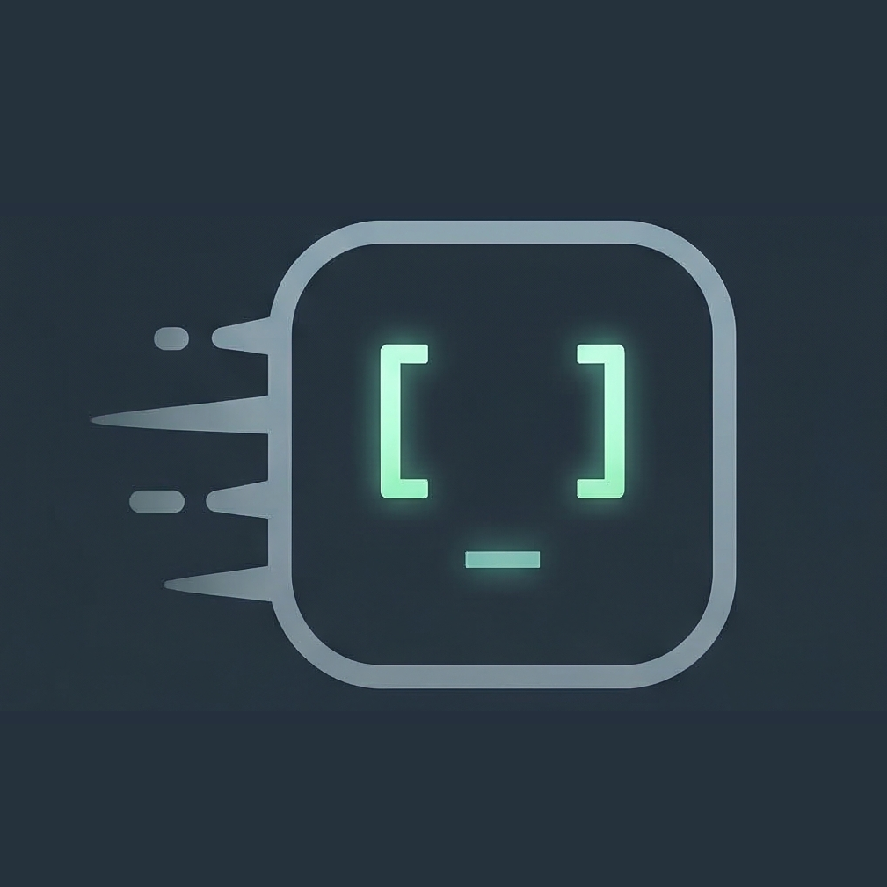
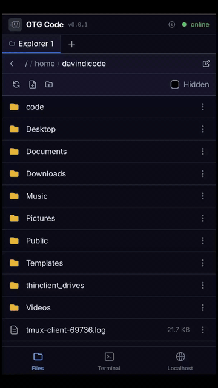
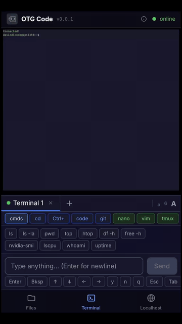
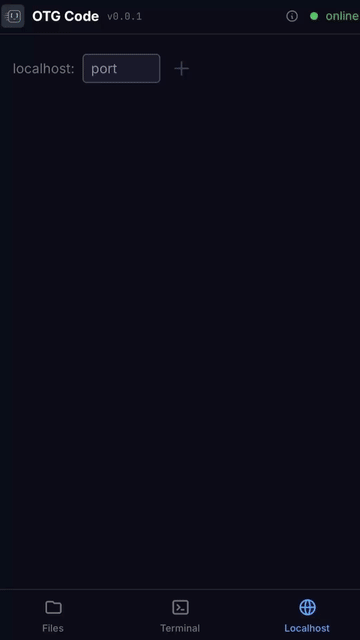

<p align="center">
  
</p>

<h1 align="center">OTG Code</h1>
<p align="center"><em>On-The-Go Code — a mobile-first, terminal-focused development environment in the browser</em></p>

<p align="center">Work on your VPS or home machine from anywhere — phone, tablet, or desktop — with zero client-side installation. A mobile-optimised terminal built for coding CLIs, with file explorer, code editor, and localhost proxy — all in a single browser tab, accessible via a single Cloudflare Quick Tunnel.</p>

<p align="center">
  
  
  <a href="LICENSE"></a>
  = 20">
  
  
  
</p>

## Features

<!-- Product demo previews (GIFs) -> use table for consistent GitHub layout -->
<table align="center">
  <tr>
    <td align="center" style="padding:8px">
    <a href="public/videos/demo_explorer.gif" title="Open Explorer GIF"></a>
      <div style="font-size:13px;color:#555;margin-top:8px;">File explorer</div>
    </td>
    <td align="center" style="padding:8px">
      <a href="public/videos/demo_terminal.gif" title="Open Terminal GIF"></a>
      <div style="font-size:13px;color:#555;margin-top:8px;">Terminal interface</div>
    </td>
    <td align="center" style="padding:8px">
      <a href="public/videos/demo_localhost.gif" title="Open Localhost GIF"></a>
      <div style="font-size:13px;color:#555;margin-top:8px;">Localhost preview</div>
    </td>
  </tr>
</table>


Three panels — **Terminal**, **Files**, and **Browser** — responsive 3-column layout on desktop/landscape, single-panel with bottom tab bar on mobile/portrait (orientation-aware breakpoint). All panels stay mounted in the DOM with CSS visibility toggling, preserving terminal state, WebSocket connections, and iframe content across navigation. Everything routes through a single Cloudflare Quick Tunnel.

### Terminal
- Multi-session tabs (renamable), xterm.js with configurable font size
- **Quick action tab groups** — color-coded action tabs (blue) and app tabs (green):
  - **cmds** — common shell commands (ls, top, df, free, nvidia-smi, etc.)
  - **cd** — visual directory picker with server-side CWD detection (works inside tmux)
  - **Ctrl+** — sticky modifier combos (Ctrl, Ctrl+Shift, Alt, Alt+Shift) with full A-Z and 0-9
  - **code** — coding CLI launchers (Claude Code, Codex, OpenCode) with vendor selector, permission presets, and slash commands
  - **git** — quick actions (status, log, diff, add, fetch, pull, push, stash, branch), commit with message input, git config setup (user.name/email)
  - **nano / vim** — file opener with version detection, in-app command buttons, save/exit shortcuts
  - **tmux** — session manager (list, attach, create, kill), in-session window/pane controls, auto extended-keys compatibility
- **Always-visible nav keys** below input — Enter, Bksp, arrows, Esc, Tab, PgUp/PgDn
- **Context-aware tabs** — editor mode (nano/vim) disables action tabs; tmux mode hides nano/vim; plain terminal shows everything
- Auto-reset of tmux/editor state on socket reconnect
- System info popup with OS, kernel, CPU, memory, GPU details
- Tool version detection (nano, vim, tmux, claude, codex, opencode)

### File Explorer
- Multi-session tabs (renamable), breadcrumb + editable path navigation
- Create, rename, delete files and folders; file info dialog; hidden files toggle
- Context menu (right-click / long-press), selectable/scrollable file paths
- Drag-and-drop file upload with progress tracking and per-file cancel
- Chunked upload for large files (>80 MB) to bypass Cloudflare's 100 MB request limit
- **Built-in viewers & editors:**
  - **Code Editor** — Monaco with syntax highlighting, configurable font size, word wrap
  - **Markdown Preview** — GitHub-flavored with prose styling
  - **Jupyter Notebook** — cells with type badges, rendered markdown, code, and outputs
  - **HTML Preview** — live rendered in sandboxed iframe
  - **PDF Viewer** — inline rendering with zoom and pinch-to-zoom
  - **Image Viewer** — zoom controls with full pan/scroll at any zoom level, pinch-to-zoom
  - **Video Player** — mp4, webm, ogg, mov, mkv, avi
  - **Audio Player** — mp3, wav, ogg, flac, aac, m4a

### Localhost Preview
- Preview any localhost port in a new tab via the built-in `/proxy/:port` reverse proxy
- Multi-tab port list with reachability checks and green/amber status indicators
- All localhost previews route through the same main tunnel of the app

## Quick Start

```bash
# Clone and install
git clone https://github.com/davindicode/otgcode.git
cd otgcode
pnpm install

# Create .env
cp .env.example .env
# Edit .env to set OTG_PORT, DEFAULT_SHELL, DEFAULT_CWD

# Production with Cloudflare tunnel (all-in-one)
./start.sh
```

The `start.sh` script installs dependencies if needed, builds the app, starts the server, and launches a Cloudflare Quick Tunnel — printing a public URL you can open on any device. On macOS it also clears Gatekeeper quarantine flags on node-pty binaries. If `cloudflared` is not found in your PATH, the script auto-downloads it to `.bin/` (supports macOS, Linux, and Windows on x64/arm64).

<details>
<summary><strong>DNS tip:</strong> Tunnel URL not resolving? Set your DNS to 1.1.1.1</summary>

The Quick Tunnel URL (e.g. `xxxx.trycloudflare.com`) resolves instantly on Cloudflare DNS but may take time on ISP/router DNS servers, or fail entirely if a stale NXDOMAIN gets cached. Set your DNS to **1.1.1.1** (Cloudflare) for instant resolution.

**macOS:**
```bash
networksetup -setdnsservers Wi-Fi 1.1.1.1 1.0.0.1
sudo dscacheutil -flushcache && sudo killall -HUP mDNSResponder
# To revert: networksetup -setdnsservers Wi-Fi empty
```

**Linux (systemd-resolved):**
```bash
resolvectl dns $(ip route show default | awk '{print $5}') 1.1.1.1 1.0.0.1
# Or permanently via /etc/systemd/resolved.conf:
# [Resolve]
# DNS=1.1.1.1 1.0.0.1
# sudo systemctl restart systemd-resolved
```

**Windows (PowerShell as Admin):**
```powershell
Get-NetAdapter | Select Name, Status
Set-DnsClientServerAddress -InterfaceAlias "Wi-Fi" -ServerAddresses 1.1.1.1,1.0.0.1
ipconfig /flushdns
# To revert: Set-DnsClientServerAddress -InterfaceAlias "Wi-Fi" -ResetServerAddresses
```
</details>

## Scripts

| Command | Description |
|---------|-------------|
| `pnpm dev` | Dev server with HMR (Socket.IO + proxy on same port) |
| `pnpm build` | Production build |
| `pnpm start` | Production server |
| `pnpm start:tunnel` | Production server + Cloudflare tunnel |
| `./start.sh` | Install + build + start + tunnel (all-in-one) |

## Architecture

Single Express server on one port handles everything:

```
Express (port 7777)
├── React Router v7 — UI (SSR shell + client-side app)
├── Socket.IO — real-time terminal I/O via node-pty
├── REST API — file operations (list, read, write, rename, delete, upload, download, mkdir)
├── Reverse Proxy — /proxy/:port/* forwards HTTP + WebSocket to localhost services
└── Cloudflare Tunnel — single optional tunnel via cloudflared (all traffic)
```

### Reverse Proxy

The `/proxy/:port` reverse proxy is how localhost previews work — no extra tunnels or processes needed. It handles:
- **Path rewriting** — strips the `/proxy/:port` prefix before forwarding to `127.0.0.1:<port>`
- **WebSocket upgrades** — WS connections on `/proxy/:port/...` are forwarded (supports Vite HMR, webpack-dev-server, etc.)
- **Header stripping** — removes `X-Frame-Options` and CSP headers so content can embed in the preview iframe
- **Asset path rewriting** — rewrites absolute paths in HTML, CSS, and JS (src, href, url(), ES imports) to include the `/proxy/:port` prefix so assets load correctly through the proxy
- **Port blocking** — blocks privileged ports (1–1023, except 80/443) and the OTG server port itself

**Dev server notes:** Most dev servers (Vite, webpack, Next.js) work out of the box since both HTTP and WebSocket traffic are proxied. However, dev servers that hardcode their WebSocket URL to `ws://localhost:<port>` in client-side code (bypassing the proxy path) will fail over the tunnel — the HMR connection won't reach the VPS. Vite works because its HMR client connects relative to the page origin. If a dev server's HMR breaks, configure it to use a relative or custom WebSocket path.

## Tech Stack

React Router v7, Express, Socket.IO, node-pty, xterm.js, Monaco Editor, Zustand, Tailwind CSS v4, TypeScript

## Requirements

- **Node.js** 20+
- **pnpm** (package manager)
- **C compiler** for node-pty on Linux (`apt install build-essential`)
- **cloudflared** (auto-installed by `start.sh` if not found) for remote access via Cloudflare tunnel

## License

[MIT](LICENSE)
