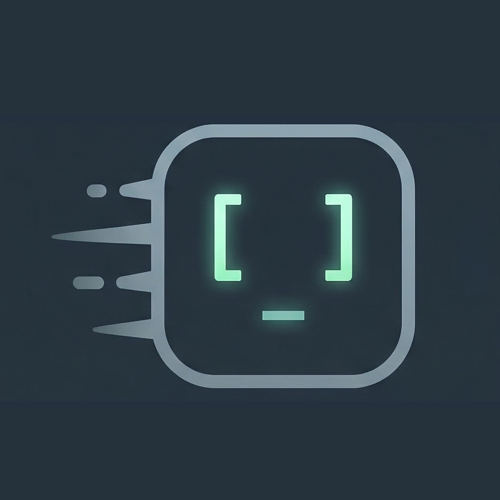
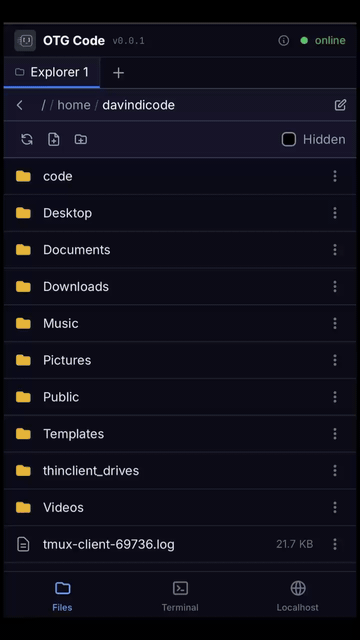
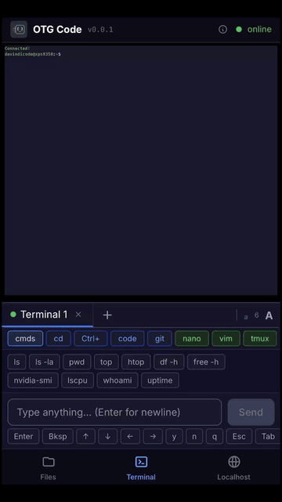
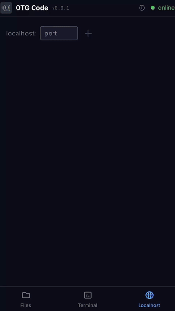

<p align="center">
  
</p>

<h1 align="center">OTG Code</h1>
<p align="center"><em>On-The-Go Code — a mobile-first, terminal-focused development environment in the browser</em></p>

<p align="center">Work on your VPS or home machine from anywhere — phone, tablet, or desktop — with zero client-side installation. A mobile-optimised terminal built for coding CLIs, with file explorer, code editor, and localhost proxy — all in a single browser tab, accessible via a single Cloudflare Quick Tunnel.</p>

<p align="center">
  
  
  <a href="LICENSE"></a>
  = 20">
  
  
  
</p>

## Features

<!-- Product demo previews (GIFs) -> use table for consistent GitHub layout -->
<table align="center">
  <tr>
    <td align="center" style="padding:8px">
    <a href="public/videos/demo_explorer.gif" title="Open Explorer GIF"></a>
      <div style="font-size:13px;color:#555;margin-top:8px;">File explorer</div>
    </td>
    <td align="center" style="padding:8px">
      <a href="public/videos/demo_terminal.gif" title="Open Terminal GIF"></a>
      <div style="font-size:13px;color:#555;margin-top:8px;">Terminal interface</div>
    </td>
    <td align="center" style="padding:8px">
      <a href="public/videos/demo_localhost.gif" title="Open Localhost GIF"></a>
      <div style="font-size:13px;color:#555;margin-top:8px;">Localhost preview</div>
    </td>
  </tr>
</table>


One pane with a single tab strip, VS Code style. Tabs come in four kinds — **Terminal**, **tmux session**, **Explorer**, and the **viewer/editor** tabs that open when you pick a file in an explorer. A tmux tab *is* its session: it runs tmux rather than a shell, so a reconnect re-attaches instead of dropping you into a shell outside it. `+` asks which kind to create; file tabs are spawned by the explorer, so an explorer always stays a file browser. Each tab's controls sit in the bottom bar and change with the tab. Localhost previews, system info and settings live in popups under the header icons. Every tab stays mounted in the DOM with CSS visibility toggling, preserving terminal state and WebSocket connections across switches. Everything routes through a single Cloudflare Quick Tunnel.

Install it to a home screen and it runs standalone like a native app; the layout, open tabs and your preferences are saved on the host, so a refresh or a reconnect from another device puts you back where you were.

### Terminal
- Terminal and tmux tabs (renamable), xterm.js at the font size set in Settings
- **Quick action tab groups** — color-coded action tabs (blue) and app tabs (green):
  - **cmds** — common shell commands (ls, top, df, free, nvidia-smi, etc.)
  - **cd** — visual directory picker with server-side CWD detection (works inside tmux)
  - **Ctrl+** — sticky modifier combos (Ctrl, Ctrl+Shift, Alt, Alt+Shift) with full A-Z and 0-9
  - **code** — coding CLI launchers (Claude Code, Codex, OpenCode) with vendor selector, permission presets, and slash commands
  - **git** — quick actions (status, log, diff, add, fetch, pull, push, stash, branch), commit with message input, git config setup (user.name/email)
- **Always-visible nav keys** below input — Enter, Bksp, arrows, Esc, Tab, PgUp/PgDn
- System info popup with OS, kernel, CPU, memory, GPU details
- Tool version detection (tmux, claude, codex, opencode)

### File Explorer
- Multi-session tabs (renamable), breadcrumb + editable path navigation
- Create, rename, delete files and folders; file info dialog; hidden files toggle
- Context menu (right-click / long-press), selectable/scrollable file paths
- Drag-and-drop file upload with progress tracking and per-file cancel
- Chunked upload for large files (>80 MB) to bypass Cloudflare's 100 MB request limit
- **Built-in viewers & editors:**
  - **Code Editor** — Monaco with syntax highlighting, configurable font size, word wrap
  - **Markdown Preview** — GitHub-flavored with prose styling
  - **Jupyter Notebook** — cells with type badges, rendered markdown, code, and outputs
  - **HTML Preview** — live rendered in sandboxed iframe
  - **PDF Viewer** — inline rendering with zoom and pinch-to-zoom
  - **Image Viewer** — zoom controls with full pan/scroll at any zoom level, pinch-to-zoom
  - **Video Player** — mp4, webm, ogg, mov, mkv, avi
  - **Audio Player** — mp3, wav, ogg, flac, aac, m4a

### Security
- **Optional access password** — off by default; turn it on from the Settings cog in the header to require a login before anything loads
- Enforced on the server for every request, the localhost proxy (HTTP + WebSocket) and the Socket.IO handshake — not just the UI
- Salted **scrypt** hash stored in `~/.otgcode/config.json` (mode 600); sessions are signed HttpOnly cookies, and changing or removing the password signs every device out
- Failed logins back off exponentially rather than locking out, so a stranger with the URL can't deny you access to your own machine

### Localhost Preview
- Port list in a popup under the globe icon in the header — compact, no panel of its own
- Preview any localhost port in a new tab via the built-in `/proxy/:port` reverse proxy
- Reachability checks with green/amber status indicators, copy-URL and remove per port
- All localhost previews route through the same main tunnel of the app

### Settings & Preferences
- **Dark and light themes** — one semantic colour token set drives the whole UI, including the terminal and code editor palettes; resolved server-side so there is no flash of the wrong theme on load
- **Terminal and editor font sizes**, adjustable from Settings
- **Saved on the host, not in the browser** — `~/.otgcode/workspace.json` keeps the theme, font size, and every open tab with its directory or file. Preferences save themselves as you change them and follow you across refreshes, reconnects and devices
- **Installable** — web app manifest, standalone display, maskable icons and iOS safe-area handling

## Requirements

| Platform | Status |
|----------|--------|
| Linux (x64 / arm64) | Supported — needs a C/C++ toolchain, see below |
| macOS (Intel / Apple Silicon) | Supported — ships prebuilt binaries, no toolchain needed |
| Windows | Through [WSL2](https://learn.microsoft.com/windows/wsl/install) only |

Native Windows is not supported. `start.sh` stops with a pointer to WSL2 if you run it under Git Bash, MSYS or Cygwin.

- **Node.js** 20 or newer
- **pnpm** 10 or newer — `npm install -g pnpm`
- **A C/C++ toolchain and Python 3** on Linux, and anywhere else `node-pty` has no prebuilt binary. It compiles `pty.node` from source there, and without it the terminal cannot start. `node-gyp` itself is a pinned devDependency, so you do not need one installed:

  | | |
  |---|---|
  | Debian / Ubuntu | `sudo apt install -y build-essential python3` |
  | Fedora / RHEL | `sudo dnf group install -y "Development Tools"` |
  | Alpine | `sudo apk add build-base python3 linux-headers` |
  | Arch | `sudo pacman -S --needed base-devel python` |
  | macOS | `xcode-select --install` |

- **cloudflared** — `start.sh` downloads it to `.bin/` for Linux and macOS (x64/arm64) if it isn't already on your PATH.

`./start.sh` checks all of this up front and says exactly what to install, rather than failing later at the first terminal you open.

<details>
<summary><strong>Windows: running under WSL2</strong></summary>

1. Install WSL2 and a distro — `wsl --install -d Ubuntu` in an admin PowerShell, then reboot.
2. Open the Ubuntu shell. Everything below happens **inside** WSL: the Windows copies of Node and pnpm will not work, because `pty.node` is a Linux binary.
3. Install Node, a toolchain and pnpm inside WSL:
   ```bash
   curl -fsSL https://deb.nodesource.com/setup_22.x | sudo -E bash -
   sudo apt install -y nodejs build-essential python3
   npm install -g pnpm
   ```
4. Clone into the **WSL filesystem** (`~/otgcode`), not `/mnt/c`. A checkout on the Windows drive is slow and breaks file watching.
5. Run `./start.sh`. The tunnel URL works from any device; from the Windows host's own browser `http://localhost:7777` reaches it too, since WSL2 forwards localhost.
</details>

## Quick Start

```bash
# Clone and install
git clone https://github.com/davindicode/otgcode.git
cd otgcode
pnpm install

# Create .env
cp .env.example .env
# Edit .env to set OTG_PORT, DEFAULT_SHELL, DEFAULT_CWD

# Production with Cloudflare tunnel (all-in-one)
./start.sh
```

The `start.sh` script installs dependencies if needed, builds the app, starts the server, and launches a Cloudflare Quick Tunnel — printing a public URL you can open on any device. On macOS it also clears Gatekeeper quarantine flags on node-pty binaries. Before building, it verifies Node, pnpm and that node-pty's native module actually loads, rebuilding it if it does not. If `cloudflared` is not found in your PATH, the script downloads it to `.bin/` (macOS and Linux, x64/arm64).

> [!WARNING]
> **Keep the tunnel URL private.** Anyone who opens it gets a terminal on the host as the user that launched OTG Code, plus read/write access to that user's files. By default the URL is the only thing protecting it. For a second layer, turn on the **access password** in Settings (the cog in the header, top right) — it puts a login in front of the app and is enforced server-side on the API, the localhost proxy and the terminal socket.
>
> Locked yourself out? Set `passwordEnabled` to `false` in `~/.otgcode/config.json` on the host and restart.

<details>
<summary><strong>DNS tip:</strong> Tunnel URL not resolving? Set your DNS to 1.1.1.1</summary>

The Quick Tunnel URL (e.g. `xxxx.trycloudflare.com`) resolves instantly on Cloudflare DNS but may take time on ISP/router DNS servers, or fail entirely if a stale NXDOMAIN gets cached. Set your DNS to **1.1.1.1** (Cloudflare) for instant resolution.

**macOS:**
```bash
networksetup -setdnsservers Wi-Fi 1.1.1.1 1.0.0.1
sudo dscacheutil -flushcache && sudo killall -HUP mDNSResponder
# To revert: networksetup -setdnsservers Wi-Fi empty
```

**Linux (systemd-resolved):**
```bash
resolvectl dns $(ip route show default | awk '{print $5}') 1.1.1.1 1.0.0.1
# Or permanently via /etc/systemd/resolved.conf:
# [Resolve]
# DNS=1.1.1.1 1.0.0.1
# sudo systemctl restart systemd-resolved
```

**Windows (PowerShell as Admin):**
```powershell
Get-NetAdapter | Select Name, Status
Set-DnsClientServerAddress -InterfaceAlias "Wi-Fi" -ServerAddresses 1.1.1.1,1.0.0.1
ipconfig /flushdns
# To revert: Set-DnsClientServerAddress -InterfaceAlias "Wi-Fi" -ResetServerAddresses
```
</details>

## Troubleshooting

### `Failed to load native module: pty.node`

`node-pty` never compiled. It ships prebuilt binaries for macOS and Windows only, so everywhere else it builds `pty.node` during install — and **pnpm 10 and newer skip a dependency's build scripts unless the package is allowlisted**, while `pnpm install` still exits 0. OTG Code allowlists it:

```json
"pnpm": { "onlyBuiltDependencies": ["node-pty"] }
```

`node-gyp` is a devDependency for the same reason: pnpm, unlike npm, does not supply one, and node-pty's install script calls bare `node-gyp`. Without it the install fails with `sh: node-gyp: command not found`, or silently uses whatever the machine happens to have.

A fresh `pnpm install` therefore compiles it. If the compile failed, or you are on an older checkout, `./start.sh` catches it at the **Native modules** step and rebuilds. By hand, from the repo root:

```bash
cd node_modules/.pnpm/node-pty@*/node_modules/node-pty
"$OLDPWD/node_modules/.bin/node-gyp" rebuild
```

Install `build-essential` (or your platform's equivalent from [Requirements](#requirements)) and `python3` first. Note that pnpm caches a build per machine, so a compile that failed once is not retried by a later `pnpm install` — use the command above, or `./start.sh`.

### The terminal crashes the server, or `pty.node` segfaults instead of erroring

A `pty.node` built by an outdated `node-gyp` can bind to the wrong Node ABI and crash on every load rather than failing cleanly. Debian and Ubuntu ship `node-gyp` 9.x as `/usr/bin/node-gyp`, which does exactly this against Node 24 — measured at 0/10 successful loads, against 10/10 for the same source under a current node-gyp.

The pinned devDependency is what prevents it, so this only bites a checkout that predates it. Rebuild with the local one:

```bash
cd node_modules/.pnpm/node-pty@*/node_modules/node-pty
"$OLDPWD/node_modules/.bin/node-gyp" rebuild
```

`start.sh` uses that same binary rather than `pnpm rebuild`, which would re-run node-pty's install script and pick up whichever `node-gyp` is on PATH again.

### After switching Node versions, or on a `node_modules` shared between machines

`pty.node` is compiled for one Node ABI and one architecture. An `nvm` switch across major versions, or a checkout shared over NFS between hosts, leaves a binary that no longer loads. `start.sh` notices on every run — loading the module *is* the check — and rebuilds it. By hand it is the same `node-gyp rebuild`.

### No root on the machine

OTG Code itself needs no `sudo`; only installing a compiler does. On a shared or HPC machine, bring your own toolchain instead:

```bash
conda install -c conda-forge gxx make    # or, on many clusters: module load gcc
```

Then re-run `./start.sh`.


## Scripts

| Command | Description |
|---------|-------------|
| `pnpm dev` | Dev server with HMR (Socket.IO + proxy on same port) |
| `pnpm build` | Production build |
| `pnpm start` | Production server |
| `pnpm start:tunnel` | Production server + Cloudflare tunnel |
| `./start.sh` | Install + build + start + tunnel (all-in-one) |

## Architecture

Single Express server on one port handles everything:

```
Express (port 7777)
├── Auth gate — optional access password, ahead of every route below
├── Workspace API — layout, open tabs and preferences in ~/.otgcode/workspace.json
├── React Router v7 — UI (SSR shell + client-side app)
├── Socket.IO — real-time terminal I/O via node-pty
├── REST API — file operations (list, read, write, rename, delete, upload, download, mkdir)
├── Reverse Proxy — /proxy/:port/* forwards HTTP + WebSocket to localhost services
└── Cloudflare Tunnel — single optional tunnel via cloudflared (all traffic)
```

### Reverse Proxy

The `/proxy/:port` reverse proxy is how localhost previews work — no extra tunnels or processes needed. It handles:
- **Path rewriting** — strips the `/proxy/:port` prefix before forwarding to `127.0.0.1:<port>`
- **WebSocket upgrades** — WS connections on `/proxy/:port/...` are forwarded (supports Vite HMR, webpack-dev-server, etc.)
- **Header stripping** — removes `X-Frame-Options` and CSP headers so content can embed in the preview iframe
- **Asset path rewriting** — rewrites absolute paths in HTML, CSS, and JS (src, href, url(), ES imports) to include the `/proxy/:port` prefix so assets load correctly through the proxy
- **Port blocking** — blocks privileged ports (1–1023, except 80/443) and the OTG server port itself

**Dev server notes:** Most dev servers (Vite, webpack, Next.js) work out of the box since both HTTP and WebSocket traffic are proxied. However, dev servers that hardcode their WebSocket URL to `ws://localhost:<port>` in client-side code (bypassing the proxy path) will fail over the tunnel — the HMR connection won't reach the VPS. Vite works because its HMR client connects relative to the page origin. If a dev server's HMR breaks, configure it to use a relative or custom WebSocket path.

## Tech Stack

React Router v7, Express, Socket.IO, node-pty, xterm.js, Monaco Editor, Zustand, Tailwind CSS v4, TypeScript

## Known Limitations

- **tmux controls belong to tmux tabs.** A tmux tab *is* its session, so its
  controls are always correct. Running `tmux attach` by hand inside a plain
  **terminal** tab still works, but that tab keeps a terminal's controls — use
  `+` → tmux session to get the session controls.
- **The code editor loads from a CDN.** Monaco is fetched from jsDelivr at
  runtime rather than bundled, so the editor needs internet access even though
  everything else works offline.

## License

[MIT](LICENSE)
